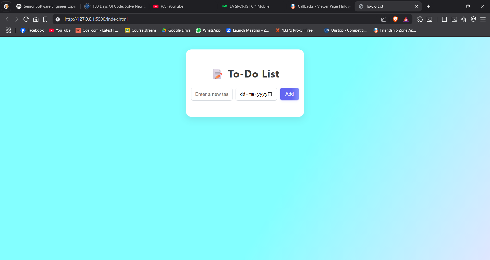
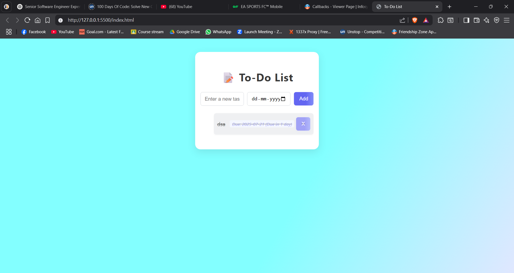

# 📝 To-Do List Web App with Deadline

A clean and efficient task manager built using **HTML, CSS, and JavaScript**. It lets users add tasks, set deadlines, mark them as complete, and delete them. All data is saved locally using `localStorage`, so your tasks persist across page reloads.

---

## 🚀 Features

- ✅ Add, complete, and delete tasks
- 📅 Set and display task deadlines
- 💾 Persistent storage using `localStorage`
- 🧠 Strike-through for completed tasks
- 📆 Optional: sorted by deadline or highlighted if overdue
- 🔄 Responsive and interactive UI

---

## 📂 Folder Structure

todo-app/
├── index.html
├── style.css
├── script.js
├── README.md
└── screenshots/
    ├── empty.png
    ├── with-tasks.png
    └── completed.png

---

## 🛠 Tech Stack

- HTML5
- CSS3
- Vanilla JavaScript
- Browser `localStorage`

## 📸 Screenshots

### 📥 Empty State (no tasks)

### 📝 Task List

### ✅ Completed Task

## 🌐 Live Demo

👉 [Click here to view the app]([https://your-username.github.io/todo-app/](https://sourav-das7887.github.io/todo-app/])  

---

## 🧠 What I Learned

- DOM manipulation and event handling
- Working with arrays and objects in JS
- Using localStorage to persist data
- Structuring a small full-featured project
- Clean UI design using only HTML/CSS

---

## ✍️ Author

**Sourav Das**  
📧 dassourav845@gmail.com  
🔗 [LinkedIn](https://www.linkedin.com/in/souravdas7887) | [GitHub](https://github.com/Sourav-Das7887)

---

## 📄 License

Open source — feel free to fork, improve, and share!
